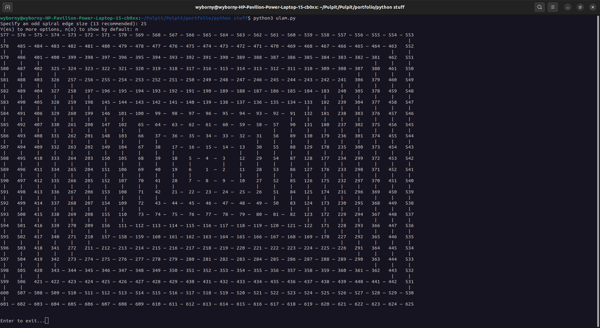
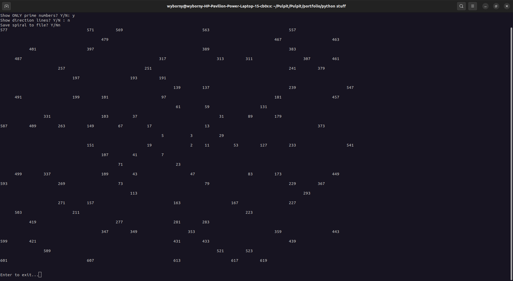

# OpenCV demo

## What it can do
The program generates the Ulam spiral according to the user's requirements. It is possible to display direction lines, prime numbers only, or save the spiral to a text file.

_full spiral_

_spiral with only prime numbers and with no lines_

